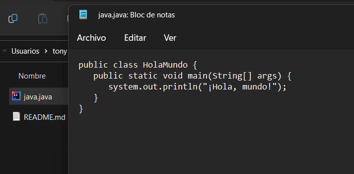
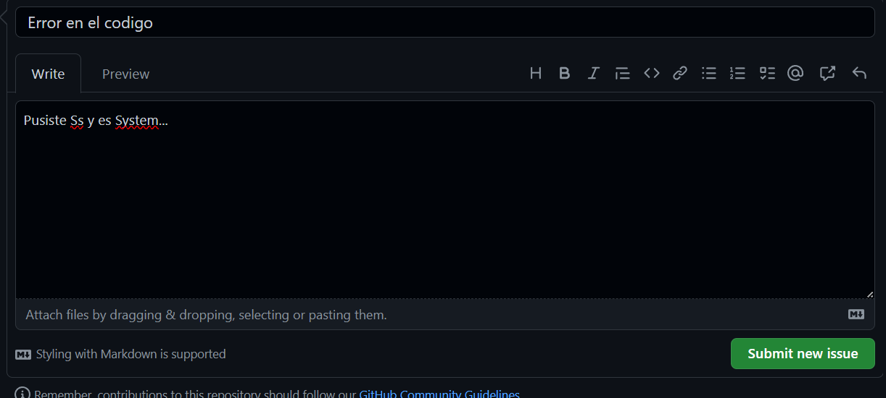
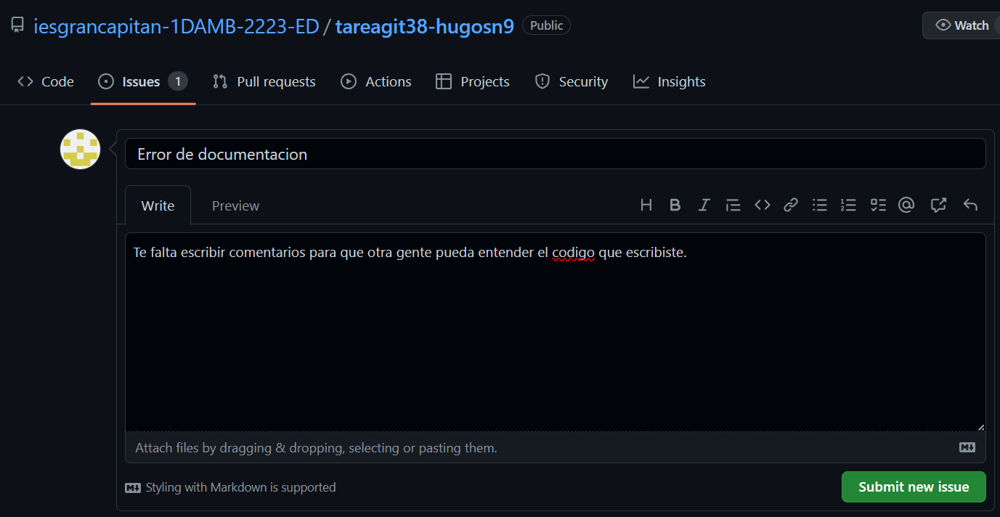
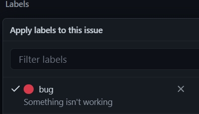
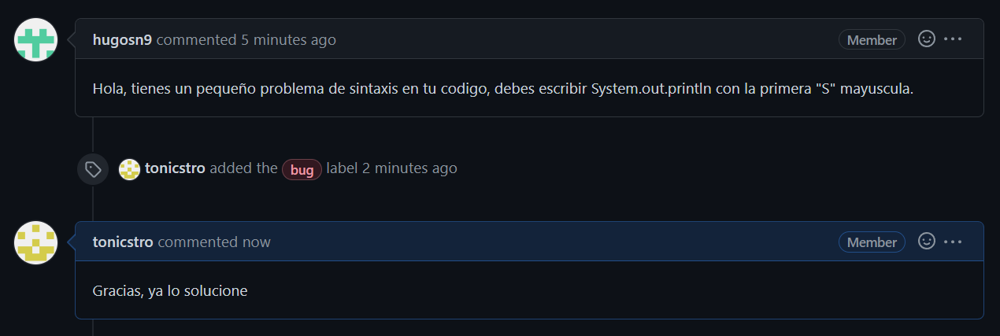
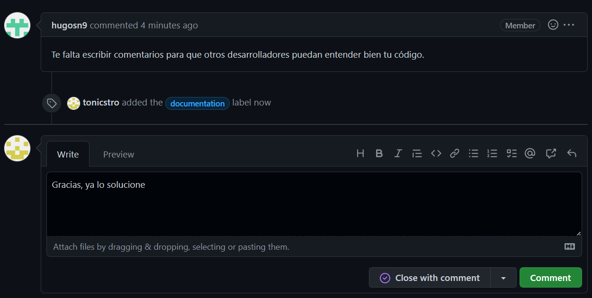
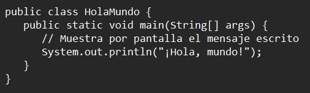
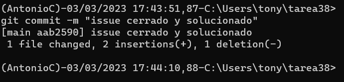

1.- Creamos un .java y escribimos ahi un codigo mal escrito y sin documentacion

2.- Le comentamos el issue a nuestro compañero del error que tuvo el

3.- Tambien le escribimos el error de documentacion que tuvo

4.- El error de sintaxis se lo marcamos con la etiqueta "bug" y le respondemos con el error solucionado

5.- Ahora igualemente le añadimos la etiqueta "documentacion" al otro issue y le respondemos igual

6.- Arreglamos nuestro codigo y lo volvemos a subir todo perfectamente

